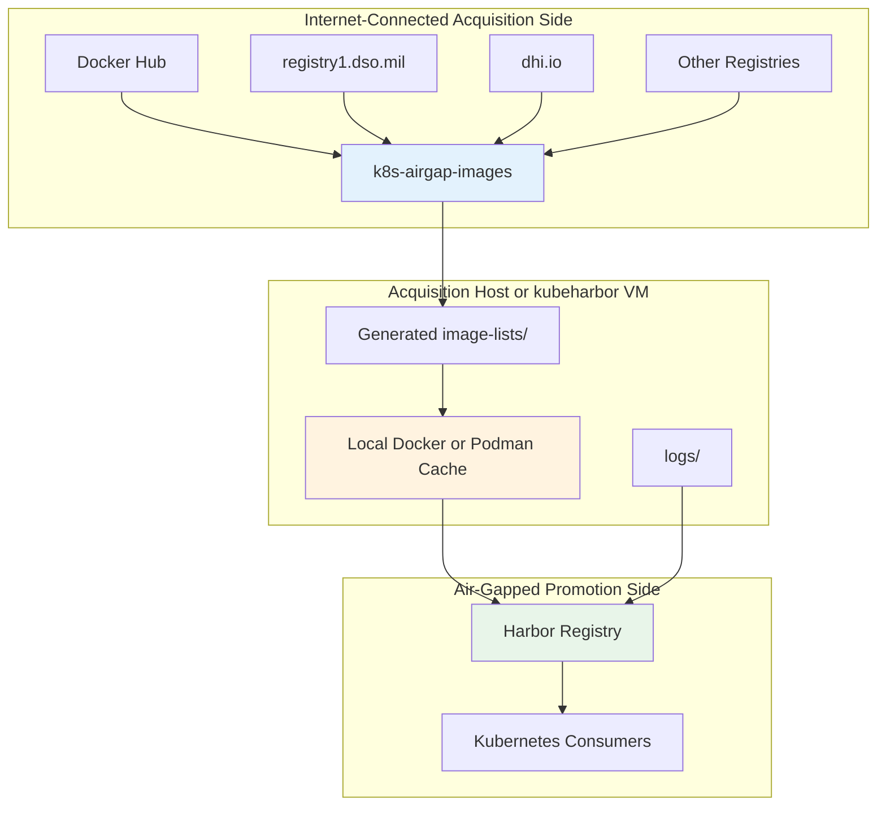
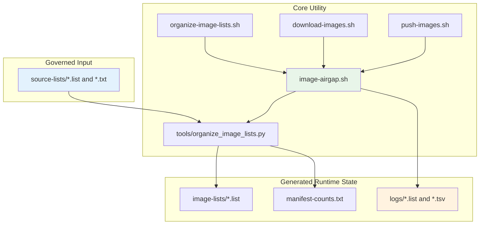
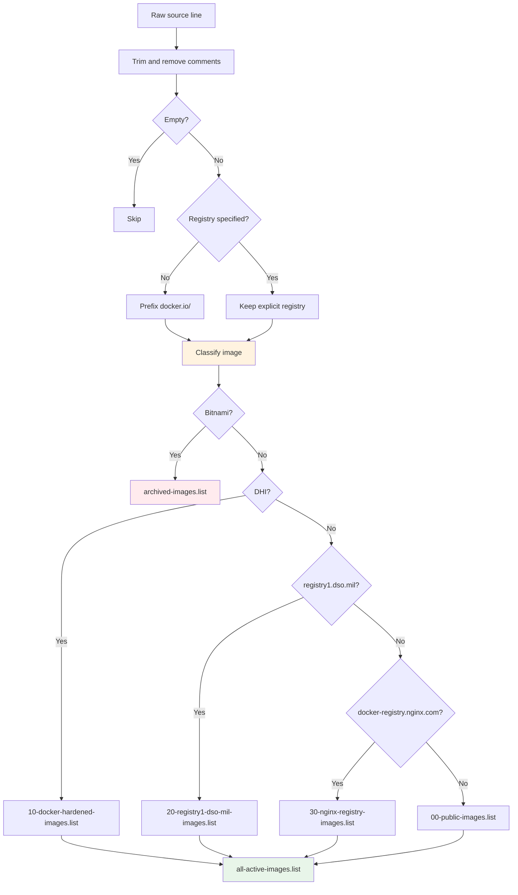
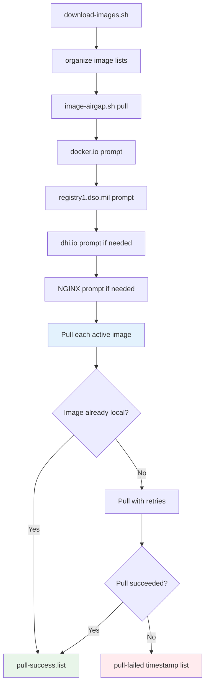
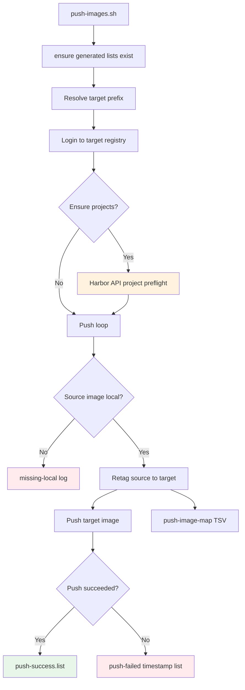
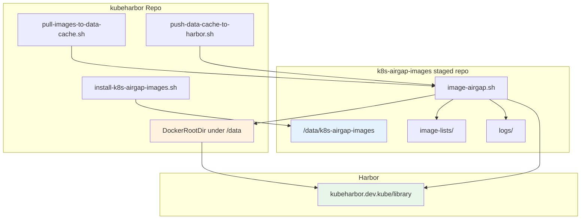

# k8s-airgap-images System Design Document

**Version:** 1.0  
**Date:** June 18, 2026

## Executive Summary

`k8s-airgap-images` is a standalone utility repository for acquiring and promoting Kubernetes platform container images into disconnected environments. It owns the image catalog, source-list normalization, registry-aware pull workflow, deterministic retagging, Harbor project preflight, push workflow, and operational logs.

The repository pairs with `cantrellr/kubeharbor`, but it is intentionally separate. kubeharbor owns the Harbor VM and registry runtime. `k8s-airgap-images` owns the image catalog and transfer workflow.

## System Context

Diagram export: [SVG](../diagrams/svg/k8s-airgap-images-diagram-01.svg) | [PNG](../diagrams/png/k8s-airgap-images-diagram-01.png)

## Repository Architecture

Diagram export: [SVG](../diagrams/svg/k8s-airgap-images-diagram-02.svg) | [PNG](../diagrams/png/k8s-airgap-images-diagram-02.png)

## Image List Processing

The organizer reads source lists, strips comments and blank lines, normalizes Docker Hub references, categorizes images by registry family, archives Bitnami images, and writes generated lists under `image-lists/`.

Diagram export: [SVG](../diagrams/svg/k8s-airgap-images-diagram-03.svg) | [PNG](../diagrams/png/k8s-airgap-images-diagram-03.png)

## Pull Workflow

The pull workflow runs on an Internet-connected host. It organizes lists, opens registry credential gates, pulls active images, retries failures, and writes pull evidence under `logs/`.

Diagram export: [SVG](../diagrams/svg/k8s-airgap-images-diagram-04.svg) | [PNG](../diagrams/png/k8s-airgap-images-diagram-04.png)

## Push Workflow

The push workflow runs after images are present in the local cache. It resolves the target prefix, authenticates to the target registry, optionally reconciles Harbor projects, retags each image, pushes the target reference, and logs source-to-target mappings.

Diagram export: [SVG](../diagrams/svg/k8s-airgap-images-diagram-05.svg) | [PNG](../diagrams/png/k8s-airgap-images-diagram-05.png)

## kubeharbor Integration

When paired with kubeharbor, this repository is staged under `/data/k8s-airgap-images`. kubeharbor wrapper scripts call the staged CLI and keep large image operations tied to the data disk.

Diagram export: [SVG](../diagrams/svg/k8s-airgap-images-diagram-06.svg) | [PNG](../diagrams/png/k8s-airgap-images-diagram-06.png)

## Security and Credential Handling

The utility prompts separately for upstream registry access during pull. For push, it can reuse target registry credentials for Harbor project preflight unless separate Harbor API credentials are supplied.

Hard rules:

- Do not commit registry credentials.
- Do not commit generated logs that contain sensitive operational details.
- Configure Docker or Podman trust before pushing to private registry endpoints.
- Use project-management credentials for Harbor project creation and scoped robot accounts for steady-state automation.
- Use insecure Harbor API mode only for lab or temporary troubleshooting.

## Operations Model

Day-0 work is source-list review and organization. Day-1 work is image pull and push execution. Day-2 work is catalog maintenance, credential hygiene, failure-log review, and periodic validation against downstream platform bundles.

## Failure Modes and Recovery

| Failure mode | Likely cause | Recovery |
| --- | --- | --- |
| No source files found | `source-lists/` empty or wrong `SOURCE_DIR` | Add source lists or set `SOURCE_DIR`. |
| Pull denied | Missing or expired upstream registry access | Re-run pull and authenticate to the relevant registry. |
| Pull failures | Missing image, rate limit, registry outage, or bad tag | Review `pull-failed` logs, correct source lists, rerun. |
| OS disk pressure | Container runtime storage not backed by `/data` | Fix runtime storage before pulling large sets. |
| Push missing local image | Image was not pulled or cache was pruned | Pull the missing image before pushing. |
| Project creation denied | Harbor account lacks project-management rights | Use an account with required Harbor permissions or precreate projects. |
| TLS unknown authority | Internal CA not trusted | Install CA trust for Docker or Podman. |

## Roadmap

1. Add optional SBOM and provenance generation for approved image-list releases.
2. Add schema validation for source-list metadata.
3. Add dry-run reports for target Harbor projects and image counts.
4. Add optional registry namespace collision checks.
